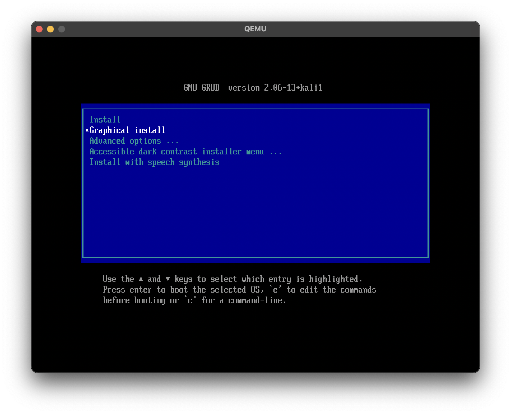
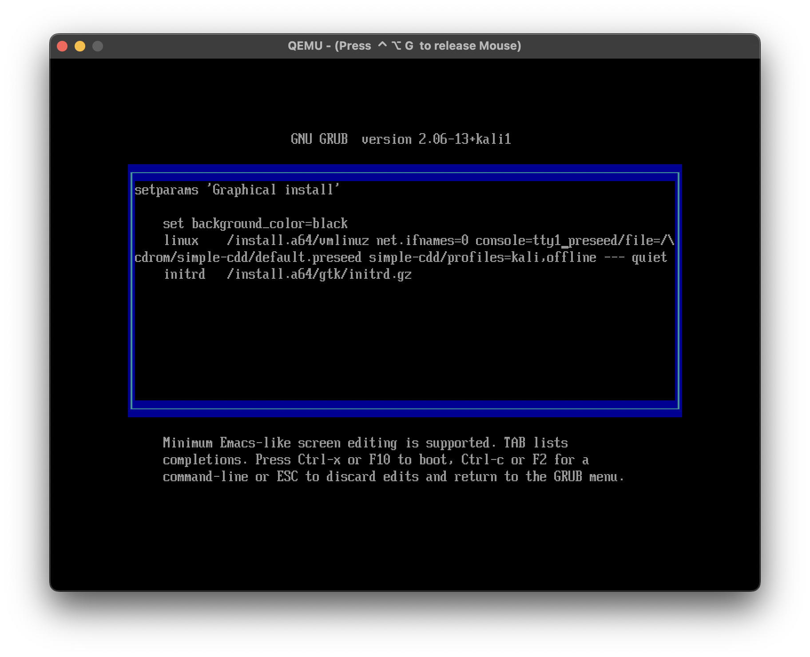
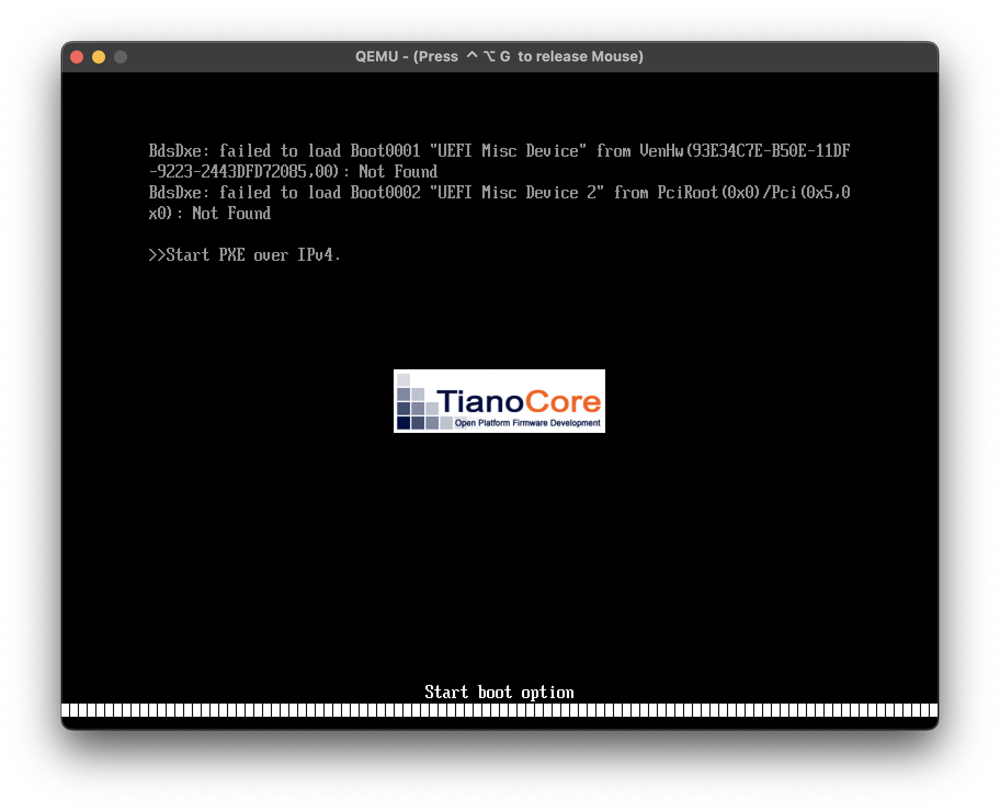
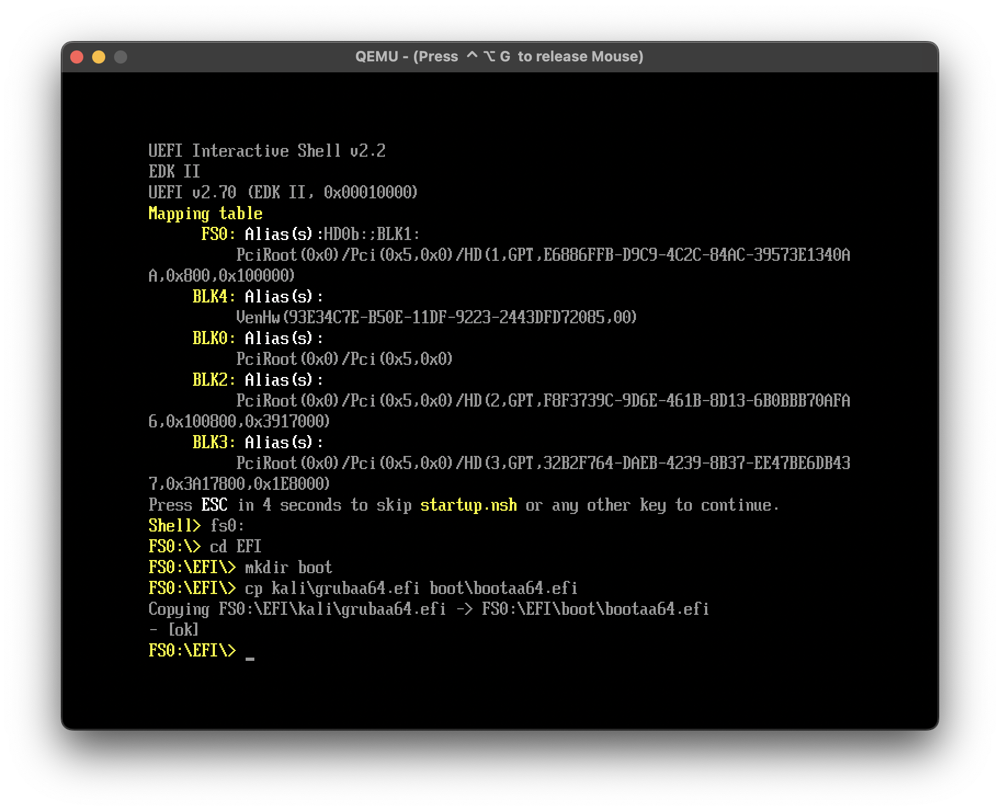
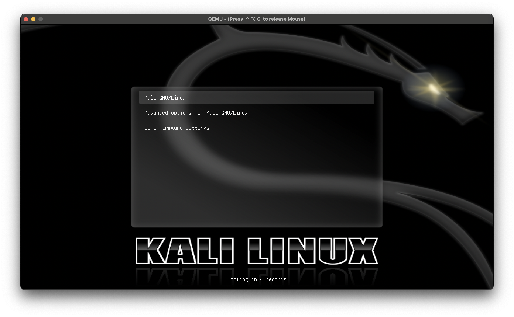

# Kali ARM VM using Qemu on MacBooks running M1/M2 processors.
This is a guide on how to install and run Kali VM (using native ARM image!).

## Prerequisites
1. Install qemu using brew
```console
brew install qemu
```
2. [Download ARM image of Kali installer from the official website](https://www.kali.org/get-kali/#kali-installer-images)
3. Download a uefi file. Either from this repo (`QEMU_EFI.fd`) or from other sources.

## How to install???
After installing all prerequsites we need to run following commands:
1. Create a new directory and cd into it
```console
mkdir kaliVM && cd kaliVM
```
2. Create a new raw virtual disk of your preferable size. I use 30GB.
```console
qemu-img create -f raw kali.raw 30G
```
3. Start qemu with following flags. (Some are redundant and I would really like if you test out different combinations to minimize them. Feel free to open an issue)
```console
qemu-system-aarch64 \
   -M virt,highmem=off \
   -accel hvf \
   -cpu host \
   -smp 4 \
   -m 3000 \
   -bios QEMU_EFI.fd \
   -boot d \
   -device virtio-gpu-pci \
   -display default,show-cursor=on \
   -device qemu-xhci \
   -device usb-kbd \
   -device usb-tablet \
   -drive file=kali.raw,format=raw \
   -device nec-usb-xhci \
   -cdrom kali-linux-2023.3-installer-arm64.iso \
   -drive file=kali-linux-2023.3-installer-arm64.iso,media=cdrom 
```
In the future you should replace the `file=...iso` with the name of an image you downloaded if it doesn't match.
4. By default installer uses a different tty after going into visual installation. So we need to change that by pressing `e` while being focused on `Graphical install`.  

Replace `console=tty0` with `console=tty1` and hit `ctrl-x` to start installation.

5. Follow the instructions and configure the system to your liking.
6. After being asked for reboot close the Qemu window or `ctrl-c` the process in terminal.
7. Boot up with this command.
```console
qemu-system-aarch64 \
   -drive file=kali.raw,format=raw \
   -boot order=d \
   -M virt \
   -accel hvf \
   -cpu max \
   -smp 4 \
   -m 4096M \
   -bios QEMU_EFI.fd \
   -device virtio-gpu-pci \
   -display default,show-cursor=on \
   -device qemu-xhci \
   -device usb-kbd \
   -device usb-tablet \
   -device nec-usb-xhci 
```
8. Unfortunately, it won't work for the first time. 

9. To actually boot into Kali we need to wait for efi shell. ( Or click `esc` on boot -> `Boot Manager`  -> `EFI Internal Shell`
Then, enter the following commands to fix the boot problem. 

10. After copying `efi` run `reset` command in the `efi shell`. VM will reload into normal Kali Bootloader! Congratz! (You won't need to do all of this EFI BS from now on)


*P.S. this is not a perfect guide and any contribution/automation will be greatly appreciated*
